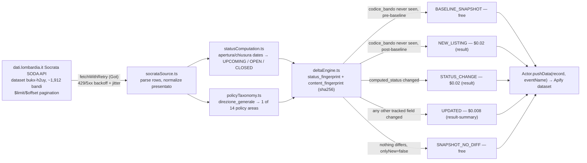

<h1 align="center">Regione Lombardia Open Grants & Tenders Registry Delta Monitor</h1>
<p align="center"><strong>Turns Regione Lombardia's official bandi registry into a NEW_LISTING / STATUS_CHANGE / UPDATED delta feed — no RSS, no login, no manual re-checking.</strong></p>

<p align="center">
<a href="https://apify.com"></a>
<a href="#cost--byok-disclosure"></a>
<a href="https://www.typescriptlang.org/"></a>
<a href="LICENSE"></a>
</p>

<p align="center">
<a href="https://apify.com/stefano_seggio/regione-lombardia-grants-registry-monitor"></a>
</p>

Live and public at [apify.com/stefano_seggio/regione-lombardia-grants-registry-monitor](https://apify.com/stefano_seggio/regione-lombardia-grants-registry-monitor). Owner console: [console.apify.com/actors/f0xRlvzERsbgbU1ru](https://console.apify.com/actors/f0xRlvzERsbgbU1ru).

**This Actor monitors Regione Lombardia's official regional grants and tenders register (`dati.lombardia.it`, Lombardy, Italy) and delivers a `NEW_LISTING` / `STATUS_CHANGE` / `UPDATED` delta feed on whatever recurring schedule you configure through Apify's own Scheduler.**

## What this Actor does

Regione Lombardia publishes every regional bando — SME grants, professional-order competitions, ICT hiring notices run through ARIA SPA, cultural and social-fund calls — on the Bandi Online portal, but that portal offers no RSS feed, no delta API, and no way to ask "what changed since I last looked" other than re-reading the whole list by eye. This Actor is a Regione Lombardia grants and tenders (bandi) monitor built directly on the region's own open-data catalog, `dati.lombardia.it`, so you stop manually polling dati.lombardia.it or Bandi Online to catch a newly published bando or a status flip from `OPEN` to `CLOSED`.

Under the hood it walks the region's Socrata SODA API dataset `Anagrafica dei bandi regionali` (`bukx-h2uy`, live-confirmed at 1,912 rows), then computes two things the source itself never publishes: a three-state lifecycle status (`UPCOMING` / `OPEN` / `CLOSED`) derived from each bando's own opening and closing dates, and a 14-category policy-area classification built from the real, observed distribution of the source's free-text `direzione_generale` field. Every run is compared against the previous one via a dual SHA-256 fingerprint, so only genuine changes are ever delivered — and billed.

Grant-writing consultants and *commercialisti* use it to track Lombardy calls for SME clients by policy area or directorate instead of re-reading Bandi Online by hand; chambers of commerce and trade associations use it to build a members' bulletin of newly opened or soon-closing bandi; journalists and open-government researchers use it to watch which directorate or in-house company (ARIA SPA, POLIS Lombardia) is running the most competitions.

## Architecture



A single global `hasCompletedBaseline` boolean guards the cold start, so a first run delivers the ~1,912 existing bandi as free `BASELINE_SNAPSHOT` records instead of ~1,912 charged `NEW_LISTING` events.

## Features

| Feature | What it does |
|---|---|
| Dual-fingerprint delta engine | `status_fingerprint` (sha256 of `computed_status`) and `content_fingerprint` (sha256 of every other tracked field) classify each bando as unchanged, `NEW_LISTING`, `STATUS_CHANGE`, or `UPDATED` on every run. |
| Computed lifecycle status | Derives `UPCOMING` / `OPEN` / `CLOSED` from `apertura_adesione` / `chiusura_adesione` against the run's own clock — the source itself publishes no status column at all. |
| 14-category policy-area taxonomy | Classifies the source's free-text `direzione_generale` field using word-boundary matching (built from the real, live-queried distribution of all 46 distinct values in the dataset), falling back to `UNCLASSIFIED` rather than guessing. |
| Delivery-time filters | `statusFilter`, `policyAreaFilter`, and `directorateFilter` narrow what's delivered without affecting internal tracking, so a filtered-out bando still fires `STATUS_CHANGE` the moment it enters your filter. |
| Server-side keyword search | `keyword` is passed straight through as Socrata's own `$q` parameter, matched against `titolo_bando`, `direzione_generale`, `ente`, and `tipo_strumento`. |
| Selectable event types | `eventTypes` restricts delivery to any subset of `NEW_LISTING` / `STATUS_CHANGE` / `UPDATED`, independent of the `statusFilter`/`policyAreaFilter` delivery filters. |
| Free full-registry preview | Running with `onlyNew: false` on a fresh `deltaStateName` delivers all ~1,912 current bandi as free `BASELINE_SNAPSHOT` records, so you can inspect the real data shape before any event is billed. |
| Named, resettable delta state | `deltaStateName` isolates baseline progress per schedule/filter combination; `resetState` re-baselines a given state from scratch. |

## Cost & BYOK Disclosure

| Event | Price | Charged when |
|---|---|---|
| `NEW_LISTING` | **$0.02** | A `codice_bando` not previously seen appears, after this schedule's baseline is established. |
| `STATUS_CHANGE` | **$0.02** | `computed_status` moves between `UPCOMING` / `OPEN` / `CLOSED`. |
| `UPDATED` | **$0.008** | Any other tracked field changes (title correction, directorate reassignment, `presentato` count) with status unchanged. |
| `BASELINE_SNAPSHOT` / `SNAPSHOT_NO_DIFF` | Free | Delivered only when `onlyNew: false`; never charged. |

- **No third-party API key required.** This Actor's `byok` status is `none`. The optional `socrataAppToken` input is not a paid or required key — it only raises your own request-rate ceiling against the free, public Socrata API and never affects billing.
- **Unchanged records are never billed.** Every bando is compared against the previous run via a dual SHA-256 fingerprint (`status_fingerprint`, `content_fingerprint`). When both match the last run, the record is classified `SNAPSHOT_NO_DIFF`, suppressed before delivery, and never charged.
- This is pure Pay-Per-Event (PPE) billing — there's no separate platform subscription. There is no metered free trial of the paid events either: the honest way to see the full dataset before spending anything is a single run with `onlyNew: false` against a fresh `deltaStateName`, which delivers all ~1,912 bandi as free `BASELINE_SNAPSHOT` records.

## Quickstart

Get an Apify API token from your account's **Settings → Integrations** page in Apify Console (or run `apify login` with the Apify CLI). All three examples below call the real Actor at `stefano_seggio/regione-lombardia-grants-registry-monitor`.

### cURL

Runs synchronously and returns the resulting dataset items directly in the response — no polling needed.

```bash
curl -X POST "https://api.apify.com/v2/acts/stefano_seggio~regione-lombardia-grants-registry-monitor/run-sync-get-dataset-items?token=<YOUR_API_TOKEN>" \
  -H "Content-Type: application/json" \
  -d '{
  "maxItems": 50,
  "onlyNew": true
}'
```

### Python (`apify_client`)

```python
from apify_client import ApifyClient

client = ApifyClient("<YOUR_API_TOKEN>")

run = client.actor("stefano_seggio/regione-lombardia-grants-registry-monitor").call(run_input={
    "onlyNew": True,
    "statusFilter": ["OPEN"],
    "policyAreaFilter": ["ECONOMIC_DEVELOPMENT_INNOVATION"],
    "deltaStateName": "sme-grants-watch",
})

for item in client.dataset(run["defaultDatasetId"]).iterate_items():
    print(item["event_type"], item["codice_bando"], item["titolo_bando"])
```

### Node.js (`apify-client`)

```javascript
import { ApifyClient } from 'apify-client';

const client = new ApifyClient({ token: process.env.APIFY_TOKEN });

const run = await client.actor('stefano_seggio/regione-lombardia-grants-registry-monitor').call({
  onlyNew: true,
  statusFilter: ['OPEN'],
  policyAreaFilter: ['ECONOMIC_DEVELOPMENT_INNOVATION'],
  deltaStateName: 'sme-grants-watch',
});

const { items } = await client.dataset(run.defaultDatasetId).listItems();
for (const item of items) {
  console.log(item.event_type, item.codice_bando, item.titolo_bando);
}
```

Every input field is optional — an empty `{}` input runs with all defaults: `onlyNew: true`, no filters, and a `"default"` delta state. Equivalent Node.js and Python scripts are also included in this repository under [`examples/`](examples).

## Use this from Claude Desktop, Cursor, or Windsurf (via MCP)

This Actor is also reachable as an MCP server through Apify's own hosted `@apify/actors-mcp-server`, scoped to just this Actor via a `?tools=` query string - not the full Delta Registry fleet.

**Claude Desktop** (via the `mcp-remote` stdio bridge):

```json
{
  "mcpServers": {
    "delta-registry-regione-lombardia-grants-registry-monitor": {
      "command": "npx",
      "args": [
        "-y",
        "mcp-remote",
        "https://mcp.apify.com/?tools=stefano_seggio/regione-lombardia-grants-registry-monitor",
        "--header",
        "Authorization: Bearer ${APIFY_TOKEN}"
      ]
    }
  }
}
```

**Cursor** (native HTTP transport):

```json
{
  "mcpServers": {
    "delta-registry-regione-lombardia-grants-registry-monitor": {
      "url": "https://mcp.apify.com/?tools=stefano_seggio/regione-lombardia-grants-registry-monitor",
      "headers": {
        "Authorization": "Bearer ${APIFY_TOKEN}"
      }
    }
  }
}
```

**Windsurf** (uses `serverUrl`, not `url`):

```json
{
  "mcpServers": {
    "delta-registry-regione-lombardia-grants-registry-monitor": {
      "serverUrl": "https://mcp.apify.com/?tools=stefano_seggio/regione-lombardia-grants-registry-monitor",
      "headers": {
        "Authorization": "Bearer ${env:APIFY_TOKEN}"
      }
    }
  }
}
```

Replace `${APIFY_TOKEN}` with a real token from [Apify Console → Settings → Integrations](https://console.apify.com/settings/integrations). Note that `mcp-remote` does not expand shell environment variables inside the JSON string itself - paste the literal token and keep this file out of version control; Windsurf's `${env:APIFY_TOKEN}` genuinely does resolve from your environment. For the full 28-actor Delta Registry MCP configuration across all three clients, see [MCP_INTEGRATION.md](https://github.com/stefanoseggio/delta-registry-website/blob/main/MCP_INTEGRATION.md).

## Input & Output Schema

### Input

This repository is a documentation/wrapper repo and does not include `.actor/input_schema.json` (see [Contributing & Local Setup](#contributing--local-setup) below) — the fields below are documented from this Actor's own live input contract as described throughout this README and its Store listing.

| Field | Type | Default | Description |
|---|---|---|---|
| `onlyNew` | boolean | `true` | Delta mode: deliver only `NEW_LISTING` / `STATUS_CHANGE` / `UPDATED` events since the last run for this `deltaStateName`. Set `false` for a full snapshot (free `BASELINE_SNAPSHOT` / `SNAPSHOT_NO_DIFF` records). |
| `statusFilter` | array of string | none (no filter) | Restrict delivery to bandi in one or more computed statuses: `UPCOMING`, `OPEN`, `CLOSED`. |
| `policyAreaFilter` | array of string | none (no filter) | Restrict delivery to one or more of the 14 policy-area categories (e.g. `ECONOMIC_DEVELOPMENT_INNOVATION`, `AGRICULTURE_FOOD`). |
| `directorateFilter` | string / array | none (no filter) | Restrict delivery by the source's free-text `direzione_generale` field. |
| `keyword` | string | none | Passed straight through as Socrata's `$q` server-side search parameter, matched against `titolo_bando`, `direzione_generale`, `ente`, and `tipo_strumento`. |
| `eventTypes` | array of string | all three | Which of `NEW_LISTING` / `STATUS_CHANGE` / `UPDATED` to deliver when `onlyNew` is on. |
| `deltaStateName` | string | `"default"` | Names the persisted delta/baseline state, so different schedules or filter sets never share or clobber each other's progress. |
| `resetState` | boolean | `false` | Forgets the named delta state and re-baselines it from scratch on the next run. |
| `socrataAppToken` | string | none | Optional, free Socrata app token that raises your own request-rate ceiling against the source API. Never affects billing. |
| `maxItems` | integer | `20` | Caps the number of records returned in a single run. Leave unset for no limit — the full register is only ~1,912 rows. |
| `requestTimeoutSecs` | integer | `30` | Per-request timeout against the Socrata API. |
| `maxRetries` | integer | `4` | Retry attempts (exponential backoff with jitter) for a 429/5xx response before a page fetch is given up on as failed. |

### Output

One dataset record per delta event, matching `.actor/dataset_schema.json` on the live Actor:

```json
{
  "record_id": "BAN-2026-04521",
  "event_id": "a1c4e9f2b5d8a1c4e7f0b3d8f2a1c9d3e6b47058",
  "event_type": "STATUS_CHANGE",
  "scraped_at": "2026-09-15T14:22:00.000Z",
  "is_new": false,
  "source_url": "https://www.dati.lombardia.it/resource/8g3e-h8jh.json?codice_bando=BAN-2026-04521",
  "codice_bando": "BAN-2026-04521",
  "titolo_bando": "Bando per il sostegno alle imprese agricole under 40",
  "direzione_generale": "Direzione Generale Agricoltura, Alimentazione e Sistemi Verdi",
  "ente": "Regione Lombardia",
  "tipo_strumento": "Contributo a fondo perduto",
  "chiusura_adesione_iso": "2026-11-30T23:59:00.000Z",
  "computed_status": "CLOSED",
  "policy_area": "AGRICULTURE_FOOD",
  "status_fingerprint": "e7f0b3d8f2a1c9d3e6b47058a1c4e9f2b5d8a1c4"
}
```

| Field | Type | Description |
|---|---|---|
| `record_id` | string | This dataset record's own id — the source's `codice_bando`. |
| `event_id` | string | Unique id for this specific delta event (record + change). |
| `event_type` | string | `BASELINE_SNAPSHOT`, `NEW_LISTING`, `STATUS_CHANGE`, `UPDATED`, or `SNAPSHOT_NO_DIFF`. |
| `scraped_at` | string (ISO 8601) | When this run fetched the record. |
| `is_new` | boolean | Whether `codice_bando` had never been seen before this event. |
| `source_url` | string | Direct Socrata SODA API URL for this record. |
| `codice_bando` | string | The source's own bando identifier. |
| `titolo_bando` | string | Bando title, as published. |
| `direzione_generale` | string | Issuing regional directorate (free text in the source). |
| `ente` | string | Publishing body (typically "Regione Lombardia"). |
| `tipo_strumento` | string | Type of funding instrument, e.g. grant vs. contribution. |
| `chiusura_adesione_iso` | string (ISO 8601) | Closing date/time used to compute `computed_status`. |
| `computed_status` | string | This Actor's own derived lifecycle status: `UPCOMING`, `OPEN`, or `CLOSED` — not published by the source. |
| `policy_area` | string | One of the 14 policy-area taxonomy categories, classified from `direzione_generale`. |
| `status_fingerprint` | string | SHA-256 hash of `computed_status`, used to detect `STATUS_CHANGE` across runs. |

Additional fields present in `.actor/dataset_schema.json` but not shown above: `apertura_adesione_iso` (opening date/time), `presentato` (applications submitted so far, normalized to a number), `changed_fields` (populated on `STATUS_CHANGE`/`UPDATED`), `content_fingerprint` (SHA-256 over every other tracked field, drives `UPDATED` classification), and `license` (this dataset's license framing, per the live Actor's schema).

## Why not just scrape it yourself

- **Zero infrastructure** — no server, cron box, or database to stand up and patch; Apify hosts the run, the persistent delta state, and the resulting dataset.
- **Managed scheduling** — attach an Apify Schedule and it runs unattended against a source that itself only refreshes monthly, with no cron job to hand-roll or babysit.
- **No proxy/rate-limit babysitting** — `fetchWithRetry` already backs off with jitter on Socrata's 429/5xx responses, and an optional free Socrata app token removes the shared-IP throttle ceiling entirely, with no code to write.
- **Built-in delta/cross-run change detection** — the dual SHA-256 fingerprint, computed lifecycle status, and policy-area classification are none of them present in the source API, so you get `NEW_LISTING` / `STATUS_CHANGE` / `UPDATED` events instead of re-diffing ~1,912 rows by hand on every check.

## Known limitations

- The source itself refreshes monthly (Socrata's own declared metadata for `bukx-h2uy`), so this Actor cannot report a change faster than Regione Lombardia republishes the register.
- `computed_status` is this Actor's own inference, not an official field — the source publishes no lifecycle-status column at all.
- `direzione_generale`, `ente`, and `tipo_strumento` are free text with no controlled vocabulary in the source, so `directorateFilter` is a substring match that will silently miss records if a directorate is renamed.
- The policy-area taxonomy will classify anything genuinely new as `UNCLASSIFIED` until the mapping is updated, since it's built from a point-in-time snapshot of the dataset's own value distribution.

Full details, including a real live-fetched example record and the offset-pagination race condition, are documented in the Actor's own README on Apify Console.

## Contributing & Local Setup

**This repository is a documentation and integration wrapper, not the Actor's source.** It intentionally contains only this README, the [`LICENSE`](LICENSE), and ready-to-run [`examples/`](examples) scripts — there is no `src/` directory here, and there is nothing to `git clone && apify run` against. The Actor's actual scraping, fingerprinting and delta-engine implementation is proprietary and runs privately on Apify's platform; it is not published in this GitHub repository.

What you *can* do here:

- Run the Actor for real via the [Apify Store](https://apify.com/stefano_seggio/regione-lombardia-grants-registry-monitor), the CLI (`apify call regione-lombardia-grants-registry-monitor --input '{...}'`), or the API/SDK examples above — no source access is needed to use it.
- Open an issue or PR against this repo for anything that *is* here: README corrections, the `examples/` Node.js/Python snippets, or licensing questions on the wrapper content itself.
- For bug reports or feature requests against the Actor's actual behavior, use the Issues tab on this repo or on the [Apify Store listing](https://apify.com/stefano_seggio/regione-lombardia-grants-registry-monitor) — they route to the same maintainer either way.

## Code snippets

Minimal Node.js and Python examples calling this Actor via `apify-client` are included in this repository under [`examples/`](examples).

## License

The code, configuration, and documentation in **this repository** are licensed under MIT (see [`LICENSE`](LICENSE)) — this covers the wrapper/documentation content only. The Actor's own implementation running on Apify Console is proprietary and not included in this repository.

---

### About Delta Registry

This Actor is part of **Delta Registry** — pay-per-event regulatory and compliance data infrastructure built and operated by Stefano Seggio. For professional inquiries or enterprise licensing, reach out on [LinkedIn](https://www.linkedin.com/in/stefanoseggio-deltaregistry); for the rest of the fleet, see [github.com/stefanoseggio](https://github.com/stefanoseggio).
